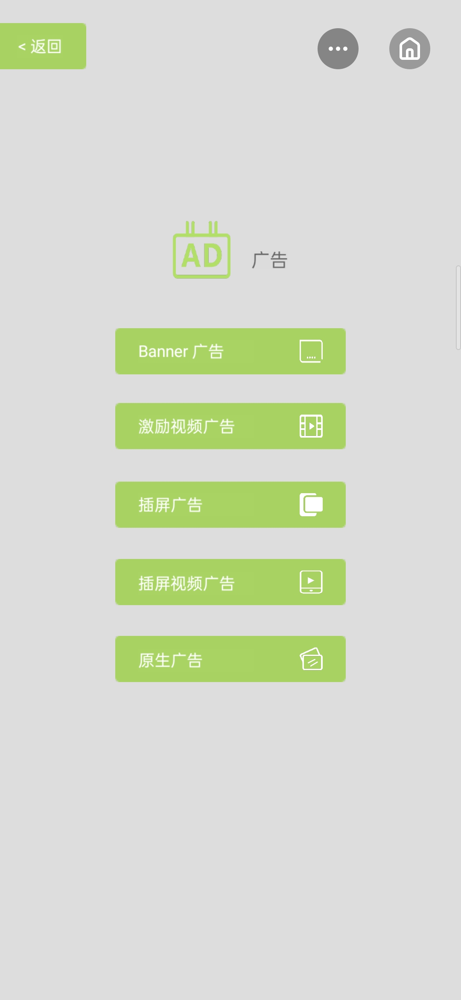

## 小游戏示例说明文档

### 项目简介

本项目展示了 OPPO 小游戏平台的各种能力，旨在给 OPPO 小游戏开发者体验视觉、操作效果与代码参考，是使用 **Cocos** 引擎 **v2.1.1** 版本开发的小游戏，并上架到了 OPPO 小游戏大厅上，可直接在小游戏大厅搜索“**示例**”体验





### 项目目录结构

项目代码资源统一放在 `assets` 文件夹下，目录采用扁平化的结构，一个 `ts` 文件代表一个页面，页面中也尽量放不超过五个功能，方便查看 `demo` 参考代码

[源码 demo 下载](https://github.com/oppominigame/littleGameDemo)

<!-- |   |     |-InsertAd.ts                              插屏广告
|   |     |-InterstitialVideoAd.ts                   插屏视频广告 -->

```text
├─assets                                             项目代码资源统一存放地
|   ├─Scene                                          存放各种场景页面(目录结构与 Script 对应)
|   ├─Script                                         存放页面代码逻辑 ts 文件
|   |   ├─ad                                         广告相关
|   |     |-Ad.ts                                    广告首页
|   |     |-BannerAd.ts                              banner 广告
|   |     |-BannerBoxAd.ts                           互推盒子横幅广告
|   |     |-NativeAd.ts                              原生广告
|   |     |-PortalBoxAd.ts                           互推盒子九宫格广告
|   |     |-SmallNativeAd.ts                         原生广告 320 x 210
|   |     |-BigNativeAd.ts                           原生广告 640 x 320
|   |     └RewardVideoAd.ts                          激励视频广告
|   |   ├─dataReading                                数据读写相关
|   |     |-DataReading.ts                           数据读写首页
|   |     |-File.ts                                  文件
|   |     └Storage.ts                                存储
|   |   ├─detectFace                                 人脸检测
|   |     └detectFace.ts                             人脸检测
|   |   ├─device                                     设备相关
|   |     |-Accelerometer.ts                         加速计
|   |     |-Battery.ts                               电量
|   |     |-Clipboard.ts                             剪贴板
|   |     |-Compass.ts                               罗盘
|   |     |-Device.ts                                设备首页
|   |     |-NetworkType.ts                           网络状态
|   |     |-Screen.ts                                屏幕
|   |     |-Vibrate.ts                               振动
|   |     └WindowResize.ts                           窗口变化
|   |   ├─interface                                  界面相关
|   |     |-Interface.ts                             界面首页
|   |     |-Keyboard.ts                              键盘
|   |     └TipFrame.ts                               提示框
|   |   ├─location                                   位置
|   |   ├─media                                      媒体相关
|   |     |-Audio.ts                                 音频
|   |     |-Img.ts                                   图片
|   |     |-Media.ts                                 媒体首页
|   |     |-RecorderManager.ts                       录音
|   |     └Video.ts                                  视频
|   |   ├─network                                    网络相关
|   |     |-Download.ts                              下载
|   |     |-Network.ts                               网络首页
|   |     |-Upload.ts                                上传
|   |     |-WebSocket.ts                             WebSocket
|   |     └XMLHttpRequest.ts                         XMLHttpRequest
|   |   ├─Pay.ts                                     支付
|   |   ├─Platform.ts                                平台能力
|   |   ├─platformTool                               平台工具
|   |     |-Performance.ts                           性能
|   |     |-PlatformTool.ts                          平台首页
|   |     └VConsole.ts                               控制台
|   |   ├─render                                     渲染相关
|   |     |-Font.ts                                  字体
|   |     |-Fps.ts                                   帧率
|   |     └Render.ts                                 渲染首页
|   |   ├─system                                     系统相关
|   |     |-LifeCircle.ts                            生命周期
|   |     |-System.ts                                系统首页
|   |     |-SystemEvents.ts                          系统事件
|   |     └SystemInfo.ts                             系统信息
|   |   ├─voice                                      语音相关
|   |     └Voice.ts                                  多人实时语音
|   |   ├─Main.ts                                    主页
|   ├─Texture                                        存放图片资源
├─build                                              项目构建后会生成build目录
|   ├─quickgame                                      项目名
|   |   └dist/com.oppo.littleGameDemo.rpk     小游戏示例游戏包名，移动至手机games目录下，即可在快应用中调试游戏
```
> 注：此为核心目录架构，已增添新接口，具体请查看源代码注释

### 代码规范

1. 一个页面一个 `ts` 文件， `ts` 文件命名采用驼峰，统一放在 `Script` 里面，以文件夹分类，采用 `es6`语 法
2. 图片资源统一放在 `Texture`

### 各页面注意点

页面功能点具体逻辑参考代码注释，以下列出注意点：

1. 平台能力 `Platform.ts`
   - 版本号：暴露了全局变量 window.Global.platformVersionCode ,方便其他功能（比如环境检测）的 `platformVersionCode` 获取
   ```js
   qg.getSystemInfo({
     success: res => {
       console.log(`系统信息: ${JSON.stringify(res)}`)
       // 全局储存平台版本号，后续可以通过 window.Global.platformVersionCode 获取，以检测某些游戏能力平台版本是否支持
       window.Global = {
         platformVersionCode: res.platformVersionCode
       }
     },
     fail: err => {
       console.log(`获取系统信息出错: ${JSON.stringify(err)}`)
     }
   })
   ```
2. 支付 `Pay.ts`

   - 流程：

   ```
     ①.小游戏示例中点击平台能力的登录按钮，再点击发起支付按钮，发送 appid、 token 等数据给服务器
     ②.服务器处理整合数据（请求数据携带回调 URL，方便平台返回数据）并用私钥签名，向平台发起统一下单请求
     ③.平台返回订单号等数据给服务器的回调地址,服务器返回时间戳、订单号、appkey、支付签名给小游戏
     ④.小游戏调起平台发起支付的接口请求
     ⑤.用户支付，可设置支付通知
   ```

   - 服务器代码：置于 `server` 文件夹下，是用 `Node.js` 编写的 `demo` ， `java` 的签名步骤可参考小游戏开发文档
   - 小游戏支付代码：置于 `Pay.ts`, 注意支付之前得先登录获取 `token`
3. 实时语音`Voice.ts`

> 注意： 得是测试环境快应用或者换成有语音权限的小游戏包名（换包名得构建配置 manifest.json 中的package名称以及后端代码中的pkg都得换）

   - 流程：
   ```
     ①.小游戏示例中点击平台能力的登录按钮
     ②.开启实时语音服务器，即在 server 文件夹下运行 node voice.js，后端 ip 中输入电脑 ip 地址
     ③.房间 id 输入数字，数字这是房间的唯一标示，同在一个房间才能听到彼此语音，记得不要静音麦克风以及扬声器
     ④.最后即可点击按钮操作，服务器处理整合数据并签名后向小游戏服务器发起语音请求
   ```

   - 服务器代码：置于 `server` 文件夹下的 `voice.js`，是 `Node.js` 编写的， `java` 的签名步骤可参考小游戏开发文档
   - 小游戏实时语音代码：置于 `Voice.ts`, 注意加入房间之前得先登录获取 `token`
   
### 项目调试方法

- 小游戏示例：使用 CocosCreator 构建发布后将 `build\quickgame\dist` 目录下的 `com.oppo.littleGameDemo.rpk` 复制粘贴到 OPPO 手机的 games 目录下，之后在快应用中可查看到应用效果，并可在 `chrome` 调试，具体调试方法参考小游戏文档： [chrome 调试](https://activity-cdo.heytapimage.com/cdo-activity/static/201810/26/quickgame/documentation/#/games/debug) ，[runetime 使用说明](https://activity-cdo.heytapimage.com/cdo-activity/static/201810/26/quickgame/documentation/#/games/use)
- 支付服务端：所在 `server` 目录执行 `node index.js` 即可，注意先 `npm i` 安装依赖
